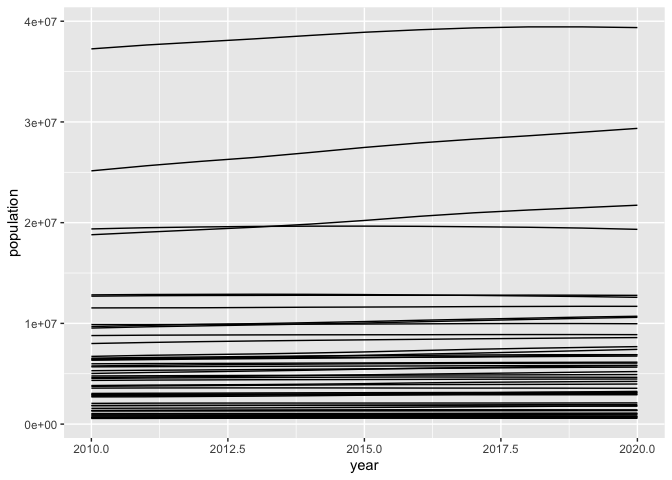
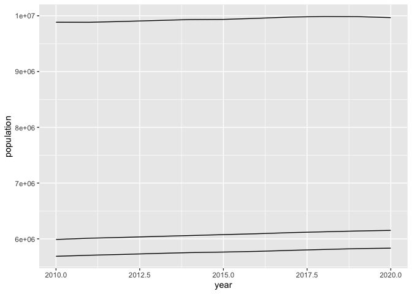
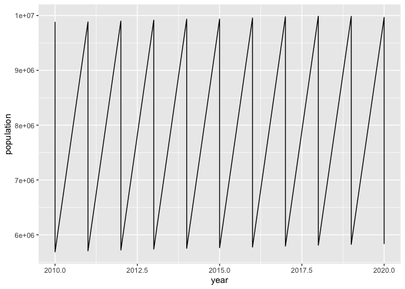
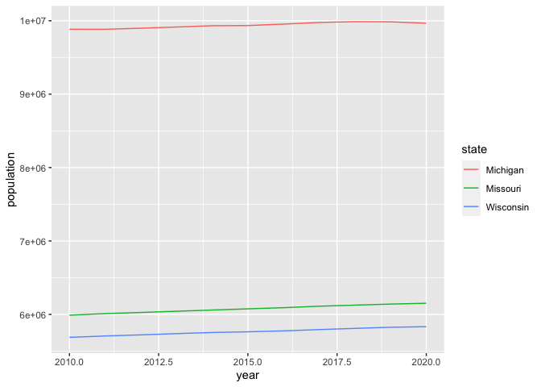
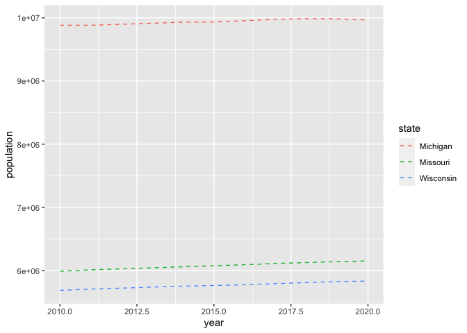

In recent newsletters we’ve been using a dataset describing how the population size of different regions of the United States changed between the 2010 and 2020 censuses. Over the next few weeks, I’d like to make a line plot of each state’s population as it changed over the past 10 years. If you were successful in completing the exercises last week, you should have code like I do here that produces a data frame with a column for the region, state, year, and population. Unfortunately, that year column isn’t formatted like a number. We’ll do that today!

    library(tidyverse)

    census_csv <- read_csv("https://www2.census.gov/programs-surveys/popest/datasets/2010-2020/national/totals/nst-est2020.csv")

    region <- census_csv %>%
      filter(SUMLEV == "020") %>%
      select(REGION, region_name = "NAME")

    state <- census_csv %>%
      filter(SUMLEV == "040") %>%
      select(-SUMLEV, -DIVISION, -STATE) %>%
      rename(state = NAME)

    census_summary <- inner_join(region, state, by="REGION") %>%
      select(region_name, state, CENSUS2010POP, starts_with("POPESTIMATE2")) %>%
      pivot_longer(cols=-c(region_name, state),
                   names_to="year",
                   values_to="population") %>%
      filter(year != "POPESTIMATE2010") %>%
      mutate(year = str_replace(year, "CENSUS", ""),
             year = str_replace(year, "POPESTIMATE", ""),
             year = str_replace(year, "POP", ""),
             year = as.numeric(year))

We can now take `census_summary` and make a line plot showing the change
in population over the past 10 years for each of the 50 states.

    census_summary %>%
      ggplot(aes(x=year, y=population, group=state)) +
      geom_line()

Oof. That looks pretty bad! Let’s see if we can clean that up a bit
using several different strategies.

1\.  Complete the `filter` function below to generate a line plot showing
    the population of Michigan, Wisconsin, and Missouri. Feel free to
    replace these states with your favorites

<!-- -->

    census_summary %>%
      filter(state == "Michigan" | _______ == _______ | _______ == _______) %>%
      ggplot(aes(x=year, y=population, group=state)) +
      geom_line()

    census_summary %>%
      filter(state == "Michigan" | state == "Wisconsin" | state == "Missouri") %>%
      ggplot(aes(x=year, y=population, group=state)) +
      geom_line()

2\.  What happens if you remove the `group=state` argument from the `aes`
    function in `ggplot`? Do you understand what is happening? What
    happens if you replace the `group=state` with `color=state`?

<!-- -->

    census_summary %>%
      filter(state == "Michigan" | state == "Wisconsin" | state == "Missouri") %>%
      ggplot(aes(x=year, y=population)) +
      geom_line()

Without the `group` argument, `geom_line` “connects the dots” of all of
the points in `year` and `population`. The `group` argument tells
`geom_line` which points go together for an individual line. In this
case you can use the `color` argument in place of the `group` argument.

    census_summary %>%
      filter(state == "Michigan" | state == "Wisconsin" | state == "Missouri") %>%
      ggplot(aes(x=year, y=population, color=state)) +
      geom_line()

Much better!

3\.  The `geom_line` function has an aesthetic called “linetype” that
    will allow you to created lines with various types of dashing. See
    what happens when you use `linetype=2` as an argument for
    `geom_line`? Try other numerical values to experiment with the
    different types of lines.

<!-- -->

    census_summary %>%
      filter(state == "Michigan" | state == "Wisconsin" | state == "Missouri") %>%
      ggplot(aes(x=year, y=population, color=state)) +
      geom_line(linetype=2)

