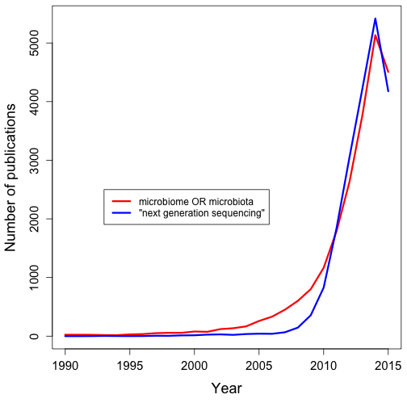

## What does all of this mean?

> * We have a rapidly growing field where there is a lot of enthusiasm
> * The people doing the work are not adequately trained in the basics of programming, much less making it reproducible
> * There is a disconnect between the people doing the work and those supervising the work.
> * We don't have a culture of sharing data and building off of others' work

---

## Goal

* Create a framework within a research team for documenting research progress, collaborating between researchers and supervisors, and ensure the reproducibility of their research as it is disseminated in publications and oral presentations.  

> * Develop a set of autotutorials to teach microbiome researchers habits for engaging in reproducible data analysis  
> * Enable researchers to improve the reproducibility of their own research and make it easier for others to "riff" off of their work.
> * See reproducibility as a ***positive***

--- &twocol

## Think about the plot from the first slide

*** {name: left}

* What would keep you from reproducing it?
* How would we update it?
* What if you wanted to plot it on a log scale?
* What if you wanted to use different search terms?
* How does this compare to the number of cancer papers published?
* What other things had I done to generate this plot?

*** {name: right}

 

--- &twocol

## Think about the plot from the first slide


```r
search_year <- function(year, term){
    query <- paste(term, "AND (", year, "[PDAT])")
    as.numeric(entrez_search(db="pubmed", term=query, retmax=0)$count)
}

year <- 1990:2015
micro <- sapply(year, search_year, term="microbiome OR microbiota", USE.NAMES=FALSE)
ngs <- sapply(year, search_year, term="next generation sequencing", USE.NAMES=FALSE)

par(mar=c(5,4.5,0.5,0.5))

plot(micro~year, type="l", lwd=3, col="red", xlab="Year",
	ylab="Number of publications", xlim=c(1990,2015), ylim=c(0, max(c(ngs, micro))),
	cex.lab=1.5, cex.axis=1.25)
points(ngs~year, type="l", lwd=3, col="blue")

legend(x=1993, y=2500, legend=c("microbiome OR microbiota",
	"\"next generation sequencing\""), lwd=3, col=c("red", "blue"))
```

--- &twocol

## Proposed autotutorials

*** {name: left}
1. The importance of reproducible research in human microbiome research
2. Maintaining an "electron trail" when documenting data analysis workflows
3. Develop a computational laboratory notebook for iterative analyses
4. Making a computational notebook collaborative

*** {name: right}


---

## Implementing the "5 E's" (Handelsman/Eisenkraft)

> * Get learners to **ENGAGE** their prior knowledge by reading and reacting to a case study.  
> * Activities will be developed where the learner has to go into the literature or their research group to **EXPLORE** a topic further via discussions and data analysis.  
> * This will encourage introspection and force them to do more **EXPLAIN**ing and less regurgitation  
> * By the time they are doing the final activity within the autotutorial the participant should be at a launch point for the participant (**ELABORATE/EXTEND**)  
> * Each autotutorial will provide an activity where the participant can **EVALUATE** their practices or those of their lab and the research community.

---

## Example: Engage prior knowledge...

* You are the member of a research group that is riding the wave of some exciting publications. The student who did the bulk of the work for your last ScienceCellNature paper has gone off to do a postdoc. Your lab is now getting inundated with emails from others asking about the nitty gritty of the methods.

<br>
> * Now what do you do?
> * How would you prevent this in the future?
> * What if the person emailing you is a competitor?  
> * Discuss this case study at the next meeting you have with your PI.


*** pnotes

Who is your most important collaborator?

1. You. Six months from now. And they're on a deserted island. Without access to email.
2. Your supervisor.
3. The world

--- &twocol

## The toolbox

*** {name: left}
* Open science and licensing
* Project organization
* Literate programming tools
  - `knitr` and `slidify` R packages
  - IPython notebook
* Version control: git and GitHub
* `make`

*** {name: right}


--- &twocol

## Evaluation

*** {name: left}
**... of the tutorials**
* Page hits
* Time on pages
* Responses to questions
* Focus groups (w/ CRLT)
* Surveys (w/ CRLT)

*** {name: right}
**... of the learners**
* Badges
* Responses to questions
* Track usage on 3rd party software
* Track papers

---

## Dissemination

* Social media
* Publish review in AEM
* Workshop at ASM General Meeting
* On site workshops
* >2500 registered `mothur` users

--- &twocol

## Opportunities and challenges

*** {name: left}
> * Make web-based learning active
> * How best to dovetail the many opportunities available for learners to pick up programming and general computational skills with this project
  * Software Carpentry
  * Data Carpentry
  * CodeAcademy
  * MOOCs

*** {name: right}
> * Integrate with other efforts
  * Other R25/T32 groups
  * Open Science Framework / Center for Open Science
  * NESCENT reproducible research workshop
  * Various blogs
> * Develop a credible badging system
