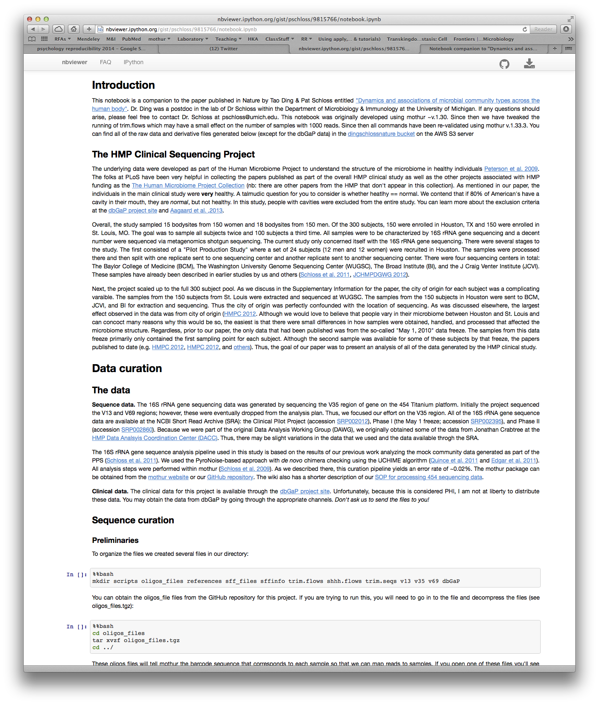

## [Elements of the scientific method (according to wikipedia)](http://en.wikipedia.org/wiki/Scientific_method#Elements_of_the_scientific_method)
* Characterizations
* Hypothesis development
* Predictions from the hypothesis
* Experiments
* Evaluation and improvement
* Confirmation

---

## Evaluation and improvement
> * PIs take it on faith that your analysis is right  
> * Few (any?) reviewers actually try to redo your science on any level  
> * Reproducibility is a critical component to doing science  
> * A flawed experiment can screw over a bunch of downstream studies  

---

## Many levels of reproducibility
> * Repeat the general experiment with a different population  
> * Repeat the general experiment with the same population  
> * Repeat the analysis using the same data  
> * Repeat the analysis using the same data and methods  

---

## I should be able to read your paper and...  

1. Download your raw, unprocessed data   
2. Read your paper and any supplements to understand what exactly you did to curate the data  
3. Repeat your analysis  
4. Support your results  
5. Do something creative that builds upon what you've done  

---

## Notes

> * This is not about whether ***you*** ....
  * ... did the analysis correctly
  * ... got the "right" answer
> * It is about whether ***I***...
  * ... am able to see what you did and repeat it
  * ... can use your data to do something more
> * Most importantly, this is not about fraud

---

## General trend: Drug discovery


# Bayer HealthCare
# Prinz et al. 2011. Believe it or not: how much can we rely on published data on potential drug targets? Nature Reviews Drug Discovery 10:712 (http://www.nature.com/nrd/journal/v10/n9/full/nrd3439-c1.html)

---

## General trend: Drug discovery

* Researchers from Amgen replicated 53 "landmark" papers and could only confirm 6 (11%) of the findings  
  - C. Glenn Begley	& Lee M. Ellis. 2012. Drug development: Raise standards for preclinical cancer research. Nature. 483:531.

* "An unspoken rule among early-stage venture capital firms that “at least 50% of published studies, even those in top-tier academic journals, can't be repeated with the same conclusions by an industrial lab” has been recently reported (see Further information) and discussed"
  - Prinz et al. 

---

## Brainstorm with your neighbor...

* 


---

## What should the goal be?
* Not this!
  * Should ***not*** have to contact the original scientists for help (what happens in 5 years?)
  * Should ***not*** have to distrust original scientists
* `write.paper`
* Note...
  * Anytime you edit a file, you lose reproducibility
  * Anytime you make a decision that is not documented, you lose reproducibility

---

## Literate programming...

* "I believe that the time is ripe for significantly better documentation of programs, and that we can best achieve this by considering programs to be works of literature. Hence, my title: 'Literate Programming.' - Donald Knuth, 1992
* The concept of combining code with documentation

> * `write.paper`

---

## Reproducibile research toolbox 

* Literate programming tools
  - Wikis
  - IPython notebook
  - `knitr` and `slidify` R packages
* Version control: github
* `make`

--- &twocol

## IPython Notebook

*** {name: left}
* An executable wiki
* Can run any programming language (including mothur)
* Can output to any format
* Used for [Ding and Schloss (2014) Nature paper](http://nbviewer.ipython.org/gist/pschloss/9815766/notebook.ipynb)


*** {name: right}


---

## knitr R package

* Very similar to IPython
* Bonus of being able to present varaiables within the text:


```r
random.numbers <- runif(10)
total <- sum(random.numbers)
```

* I randomly drew 10 random numbers. These included: 0.7171669, 0.9078193, 0.4762146, 0.578702, 0.5371592, 0.8722206, 0.1243429, 0.9542518, 0.6097173, 0.5308739
* Their sum was 6.3084685

---


